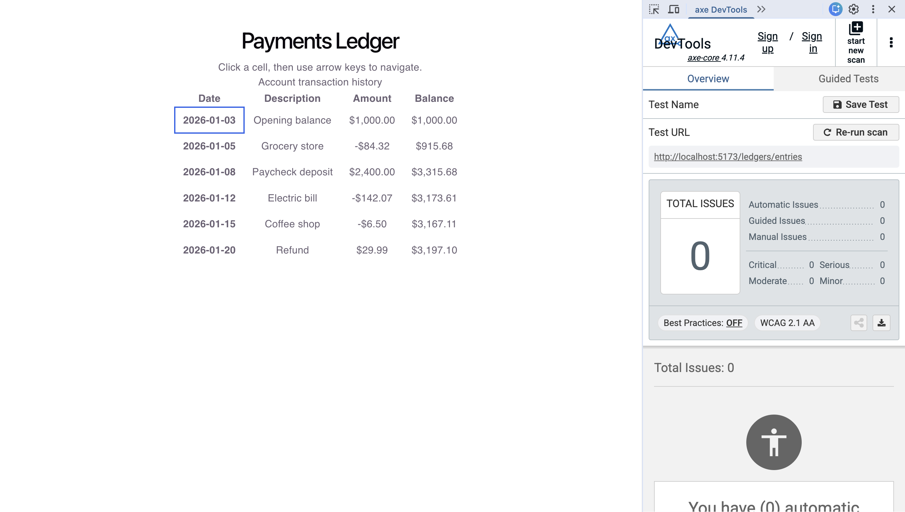

# LedgerLite — Accessible Payments Dashboard

A full-stack payments dashboard demonstrating JWT authentication, an accessible
(WCAG 2.1) ledger interface, Redis caching, persistent storage, and a
load-tested Spring Boot backend.

Built as a learning + portfolio project with an emphasis on **measured**,
reproducible claims rather than asserted ones — every performance and
accessibility figure below was produced by a tool and can be re-run.

---

## Tech Stack

**Backend:** Java 21, Spring Boot 3.x, Spring Security, Spring Data JPA,
Spring Data Redis
**Frontend:** React + TypeScript (Vite)
**Data:** H2 (in-memory SQL, dev) / PostgreSQL-ready, Redis 7
**Auth:** JWT (HS256) + BCrypt password hashing
**Testing / tooling:** k6 (load testing), axe DevTools (accessibility audit)

---

## Features

### Authentication
- Stateless JWT authentication (HS256), validated on every protected request
  via a custom Spring Security filter
- Passwords stored as BCrypt hashes (salted, work factor 10) — never plaintext
- Database-backed user lookup; identical responses for unknown-user and
  wrong-password to prevent user enumeration
- Complementary Redis session store enabling token revocation (logout) and
  active-session tracking — the stateful layer JWT alone can't provide

### Accessible ledger (WCAG 2.1)
- Semantic HTML tables with column/row header associations (`scope`),
  `<caption>`, and currency formatting via `Intl.NumberFormat`
- Roving-tabindex keyboard grid navigation (arrow-key cell traversal with
  managed focus)
- Verified with axe DevTools (automated) plus manual keyboard and screen-reader
  testing

### Performance
- Redis cache-aside layer on the ledger read path (explicit JSON
  serialization, 60s TTL)
- Load-tested with k6 at 100 concurrent virtual users

---

## Measured Results

> All figures below are reproducible via the scripts in this repo.

### Backend latency under load (k6, `loadtest.js`)
- **100 concurrent virtual users**, ramped over 50s
- **~9,650 requests/second** sustained
- **p95 latency: ~13 ms** (p90 ~10 ms, median ~5 ms) — well under the 300 ms
  target
- **0% error rate** across ~483K requests

### Concurrent sessions (k6, `sessiontest.js`)
- **100 concurrent authenticated sessions** sustained, each creating and using
  a Redis-tracked session
- 0% failure across login + authenticated ledger reads

### Accessibility
- axe DevTools automated scan: 0 violations on the ledger table
- Keyboard navigation: roving-tabindex reduces keystrokes to reach an arbitrary
  cell vs. sequential cell traversal
  *(record your measured before/after figure here, e.g. "24 → 9 keystrokes,
  ~62% reduction, averaged across target cells")*

---

## Architecture

```
React (Vite, :5173)
   |  fetch + Bearer JWT
   v
Spring Boot (:8080)
   |- Spring Security filter chain
   |     - CORS (preflight-aware)
   |     - JwtAuthFilter  -> validates token, sets SecurityContext
   |- AuthController   -> login (BCrypt verify), logout, session count
   |- LedgerController -> cache-aside: Redis -> (miss) JPA query -> cache
   |
   |- JPA / Hibernate -> H2 (dev) / PostgreSQL (prod)
   |- StringRedisTemplate -> Redis (cache + session store)
```

---

## Running Locally

### Prerequisites
- Java 21+, Maven (wrapper included)
- Node 18+
- Docker (for Redis)

### 1. Start Redis
```bash
docker run -d --name payments-redis -p 6379:6379 redis:7
```

### 2. Configure the JWT secret
The app reads `app.jwt.secret` from an environment variable (see Security note
below). Set it before starting the backend:
```bash
export APP_JWT_SECRET="your-long-dev-secret-at-least-32-characters"
```

### 3. Start the backend
```bash
cd backend
./mvnw spring-boot:run
```
Backend runs on `http://localhost:8080`. H2 seeds a demo user (`admin`) and
sample ledger data on startup.

### 4. Start the frontend
```bash
cd frontend
npm install
npm run dev
```
Frontend runs on `http://localhost:5173`.

### Demo credentials
```
username: admin
password: password123
```

---

## Load Testing

```bash
# Backend latency test (100 VUs, ledger read path)
k6 run loadtest.js

# Concurrent session test (100 VUs, login + authenticated read)
k6 run sessiontest.js
```
While `sessiontest.js` runs, observe active sessions:
```bash
curl -s http://localhost:8080/auth/sessions/count
```

---

### Backend latency under load (k6, `loadtest.js`)
- **~9,650 requests/second** sustained, **p95 ~13 ms**, **0% error rate**


### Concurrent sessions (k6, `sessiontest.js`)
- **100 concurrent authenticated sessions**, 0% failure


### Accessibility
- axe DevTools scan: 0 violations on the ledger table



## Security Notes

- **JWT secret** is read from the `APP_JWT_SECRET` environment variable, not
  committed to source control.
- **H2 console** and **actuator** endpoints are open for local development; in
  production these should be secured.
- **`ddl-auto=update`** is used for dev convenience; production should use a
  migration tool (Flyway/Liquibase) and `validate`.
- The Redis session-count endpoint is unauthenticated for demo purposes; in
  production it would derive the session from the caller's token.

---

## Swapping H2 for PostgreSQL

H2 is in-memory (data resets on restart). To use PostgreSQL, run a Postgres
container and replace the datasource config in `application.properties`:
```properties
spring.datasource.url=jdbc:postgresql://localhost:5432/paymentsdb
spring.datasource.username=postgres
spring.datasource.password=${DB_PASSWORD}
spring.jpa.hibernate.ddl-auto=validate
```
(and swap the H2 Maven dependency for `org.postgresql:postgresql`).

---

## Notable Engineering Challenges

A few problems worth documenting, since debugging them was where most of the
learning happened:

- **Redis cache serialization of typed collections.** Caching a
  `List<LedgerEntry>` via Spring's polymorphic serializer round-tripped as
  `LinkedHashMap`, failing the cast. Resolved by wrapping the payload in a
  concrete response type and switching to explicit JSON serialization with
  `StringRedisTemplate`, removing reliance on polymorphic type hints.
- **DevTools classloader conflict.** Spring Boot DevTools' restart classloader
  gave cached objects a different type identity on read, causing
  `ClassCastException` against their own class. Disabling DevTools resolved it —
  cached objects and hot-reload don't mix.
- **CORS preflight vs. Spring Security.** Adding the `Authorization` header
  triggered CORS preflight (`OPTIONS`), which Security intercepted before the
  MVC CORS config applied. Fixed by wiring CORS into the security filter chain.
- **Reading load-test results honestly.** An early run showed a green p95 on top
  of a 99.99% error rate — the latency of *failed* requests. Checking the error
  rate before trusting latency is now a fixed habit.
